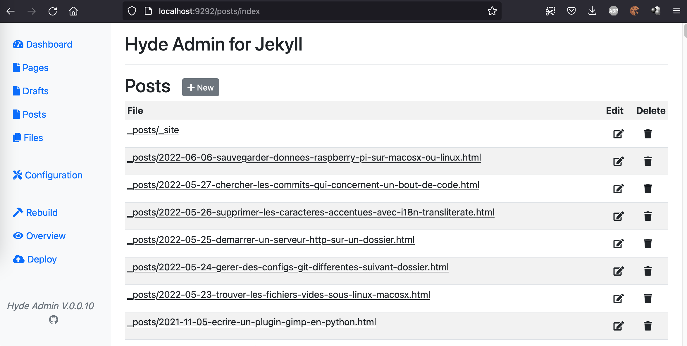

## Hyde admin

Hyde_admin is a administration frontend for Jekyll (static site generator in Ruby).



## Getting Started with Hyde Admin

# Prerequisite

Install ImageMagick (required by mini_magick)

```
apt install imagemagick
```

# Install

Add

```
gem 'hyde_admin'
```

In the Gemfile of your jekyll site.

Run

`bundle update`

# Run hyde_admin

Run 

`hyde_admin`

in your jekyll directory.
You can visit http://localhost:9292/ !

hyde_admin.yml is automatically generated in your jekyll directory.
(you can change settings with hyde_admin at http://localhost:9292/configuration or directly with text editor)

Hyde_admin allow ssh deployment with rsync.

## New version of hyde_admin ?

Just install the lastest config file (your config file will be renamed, and latest config file will be installed), run :

`hyde_admin_config`

## Error when bundle install

Try this [https://stackoverflow.com/questions/30818391/gem-eventmachine-fatal-error-openssl-ssl-h-file-not-found](https://stackoverflow.com/questions/30818391/gem-eventmachine-fatal-error-openssl-ssl-h-file-not-found)
